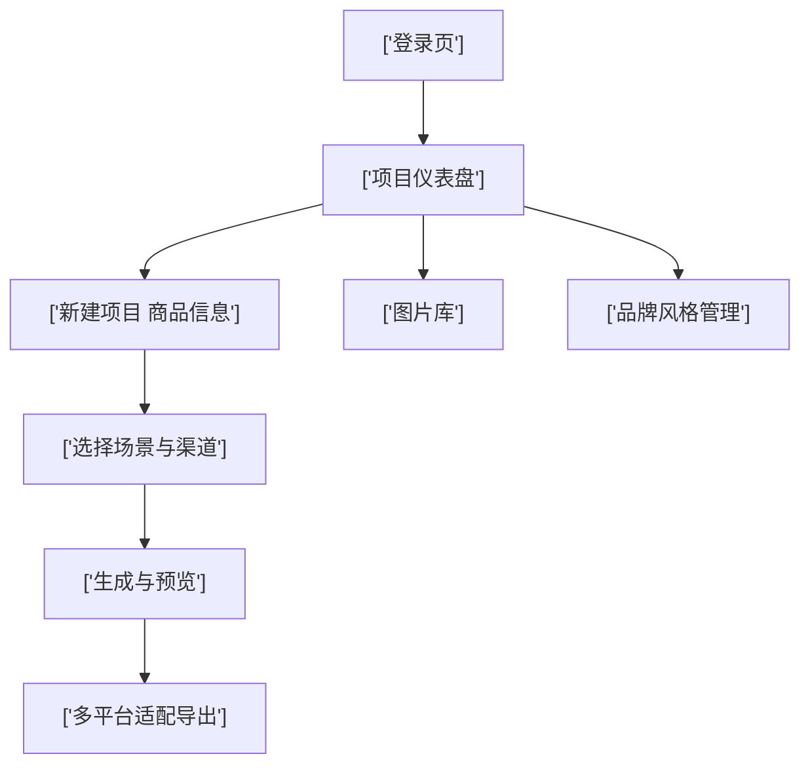

## 1. 产品概述

Wakapix 是面向跨境电商卖家的 AI 视觉工作站（SaaS 原型），通过 AI 自动生成产品场景图、白底主图、尺寸对比图、包装展示图等，并支持一键导出适配 Amazon、Shopify、TikTok Shop 等主流平台。

- 解决卖家痛点：低成本、批量、多平台合规的高质量商品图
- 目标价值：显著缩短上新时间，提升商品点击率与转化率

## 2. 核心功能

### 2.1 用户角色

| 角色 | 注册方式 | 核心权限 |
|------|----------|----------|
| 付费卖家 | 邮箱 / Google 登录 | 创建项目、AI 生成图片、多平台导出 |
| 管理员 | 内部账号 | 原型中暂不体现 |

### 2.2 功能模块

1. **登录页**：邮箱密码登录、Google 登录、忘记密码、注册入口
2. **项目仪表盘**：搜索、新建项目、项目卡片网格、状态标签
3. **新建项目 - 商品信息录入**：Amazon/Shopify 链接导入、卖点表单、AI 卖点深度解析、基础图上传
4. **选择场景与渠道**：平台选择、图片类型多选、场景风格卡片、高级设置
5. **生成与预览**：进度面板、缩略图网格、单图操作、全屏预览、默认主图星标
6. **多平台适配导出**：按平台折叠面板、文件名、预览、下载、ZIP 打包、API 上传
7. **图片库**：搜索/筛选、历史图片网格、批量操作、右键菜单
8. **品牌风格管理**：风格名称、Logo/主色调/字体/参考图、应用开关

### 2.3 页面详情

| 页面名称 | 模块名称 | 功能描述 |
|----------|----------|----------|
| 登录页 | 认证表单 | 邮箱、密码、登录按钮、忘记密码、Google 登录 |
| 项目仪表盘 | 顶部操作栏 | 标题、搜索框、新建项目按钮 |
| 项目仪表盘 | 项目卡片网格 | 产品缩略图、名称、状态、数量、进入按钮 |
| 新建项目 | 步骤条 | 3 步流程，高亮当前步骤 |
| 新建项目 | 快速导入 | Amazon 链接、Shopify 链接、模态框输入 |
| 新建项目 | 卖点表单 | 商品名称、卖点、类目、关键词标签 |
| 新建项目 | AI 卖点解析 | 浅蓝色渐变卡片、建议视觉重点、确认/手动修改 |
| 新建项目 | 基础图上传 | 拖拽区域，虚线边框 |
| 选择场景 | 平台标签 | Amazon/eBay/Shopify/TikTok Shop 横向选择 |
| 选择场景 | 图片类型 | 白底主图/场景图/尺寸对比/包装/视频封面 复选 |
| 选择场景 | 场景风格 | 4 卡片，推荐角标，选中边框橙色 |
| 选择场景 | 高级设置 | Logo 位置、文字叠加、色板选择器 |
| 生成预览 | 进度面板 | 图片类型 + 进度条 + 加载图标 |
| 生成预览 | 预览网格 | 4 列缩略图、hover 操作图标 |
| 生成预览 | 全屏预览 | 左右切换、设为默认主图 |
| 多平台导出 | 平台折叠面板 | Amazon 合规包、Shopify 主题包、TikTok Shop |
| 多平台导出 | 底部导出 | 一键下载 ZIP、API 上传、下次自动应用 |
| 图片库 | 搜索筛选 | 时间/平台/类型 |
| 图片库 | 批量操作 | 多选、批量下载/删除、右键菜单 |
| 品牌风格 | 表单 | Logo 上传、主色调、字体、参考图 |

## 3. 核心流程

登录 → 进入项目仪表盘 → 新建项目（步骤1录入商品信息）→ 步骤2选择平台/场景 → 步骤3生成预览 → 多平台导出 → 结束（或返回项目继续迭代）

## 4. 界面设计

### 4.1 设计风格

- 主色深蓝 `#1E3A5F`，辅色亮橙 `#FF6B35`，背景浅灰 `#F8F9FA`，卡片白色圆角 8px
- 字体：英文 Inter、中文 思源黑体，标题加粗，正文 14px
- 左侧固定 240px 深色导航栏，右侧自适应内容区
- 图标使用 lucide-react（系统通用风格）
- 按钮三种状态：normal / hover / active

### 4.2 页面设计概览

| 页面名称 | 模块名称 | UI 元素 |
|----------|----------|---------|
| 全局 | 左侧导航 | 项目、图片库、品牌风格、账号设置、订阅计划；选中时左侧橙色竖线 |
| 全局 | 顶部栏 | Logo、搜索、头像、额度条、升级弹窗 |
| 登录页 | 卡片居中 | Logo "PixCraft"、副标题、输入框、按钮、Google 登录 |
| 仪表盘 | 项目卡片 | 3 列网格，状态色点 |
| 商品录入 | AI 解析 | 浅蓝渐变卡片突出 |
| 生成预览 | 进度 | 纵向进度条 + 旋转加载 |
| 全屏预览 | 灯箱 | 左右切换箭头、星标 |
| 导出页 | 平台折叠 | 手风琴面板、ZIP 按钮 |

### 4.3 响应式

桌面优先 (1440px 设计宽度)，最低适配 1280px。本次原型以桌面端为主要呈现形式。
