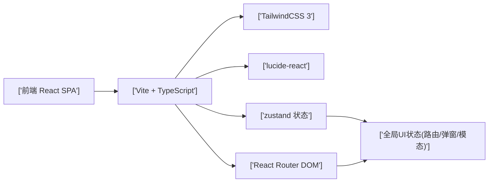
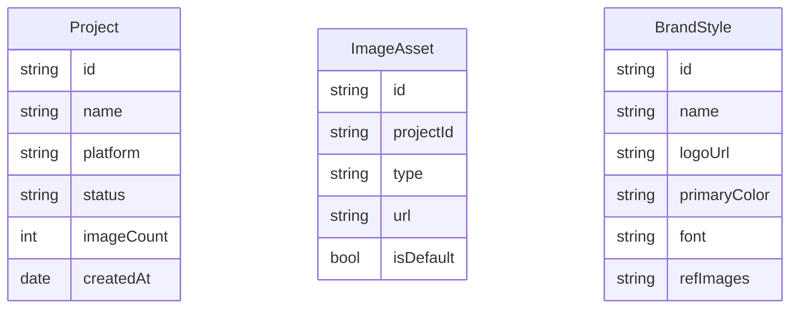

## 1. 架构设计



## 2. 技术说明

* 前端：React\@18 + TypeScript + Vite

* 样式：TailwindCSS\@3

* 路由：react-router-dom\@6

* 状态：zustand

* 图标：lucide-react

* 后端：原型阶段不提供，全部前端 Mock

* 包管理：pnpm（若可用），否则 npm

## 3. 路由定义

| 路由            | 页面     | 备注                          |
| ------------- | ------ | --------------------------- |
| /login        | 登录页    | 独立布局，无左侧导航                  |
| /register     | 注册页    | 占位                          |
| /projects     | 项目仪表盘  | 主布局                         |
| /projects/new | 新建项目流程 | 3 步骤同一路由，步骤由 query param 驱动 |
| /gallery      | 图片库    | 主布局                         |
| /brand        | 品牌风格管理 | 主布局                         |
| /settings     | 账号设置   | 主布局                         |
| /subscription | 订阅计划   | 主布局                         |

## 4. API 定义

原型阶段使用 Mock 数据，无需真实 API。预留以下接口占位（前端以函数形式 mock）：

* POST /api/import/amazon → 解析商品信息

* POST /api/import/shopify → 解析商品信息

* POST /api/ai/parse-selling-points → AI 卖点解析

* POST /api/ai/generate → 触发生成

* GET /api/projects/:id/images → 项目图片列表

* POST /api/projects/:id/export → 生成 ZIP

## 5. 数据模型（Mock）



## 6. 目录结构

```
d:\ai_proj\waka
├── index.html
├── package.json
├── vite.config.ts
├── tailwind.config.js
├── postcss.config.js
├── tsconfig.json
├── public/
└── src/
    ├── main.tsx
    ├── App.tsx
    ├── index.css
    ├── store/useStore.ts
    ├── components/
    │   ├── Layout/Sidebar.tsx
    │   ├── Layout/TopBar.tsx
    │   ├── Layout/MainLayout.tsx
    │   ├── UI/Button.tsx
    │   ├── UI/Modal.tsx
    │   ├── UI/Toast.tsx
    │   ├── UI/Input.tsx
    │   ├── UI/Tag.tsx
    │   └── common/Steps.tsx
    ├── pages/
    │   ├── Login.tsx
    │   ├── Register.tsx
    │   ├── Dashboard.tsx
    │   ├── NewProject.tsx
    │   ├── GeneratePreview.tsx
    │   ├── Export.tsx
    │   ├── Gallery.tsx
    │   ├── BrandStyle.tsx
    │   ├── Settings.tsx
    │   └── Subscription.tsx
    ├── data/mock.ts
    └── hooks/useModal.ts
```

## 7. 样式约定（Tailwind token）

```
颜色（使用 tailwind.config.js 扩展）：
--color-brand-primary: #1E3A5F
--color-brand-accent: #FF6B35
--color-bg: #F8F9FA
--color-card: #FFFFFF
--color-border: #E5E7EB
--color-text: #1F2937
--color-text-secondary: #6B7280
圆角: 8px (rounded-lg)
阴影: shadow-sm / shadow-md / shadow-lg (tailwind)
间距: 4px 基数 (4 / 8 / 12 / 16 / 24 / 32)
```

